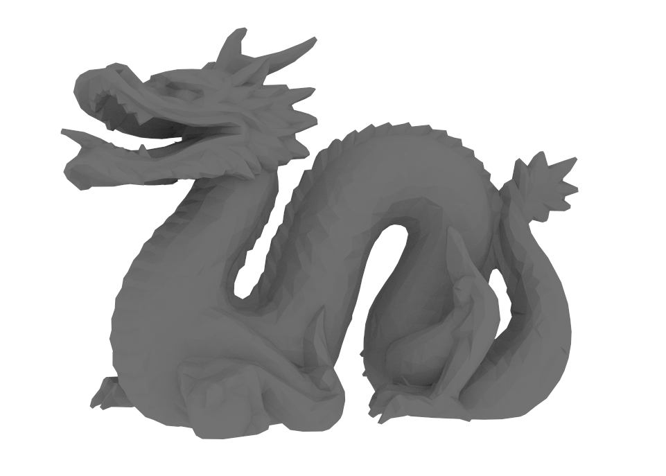
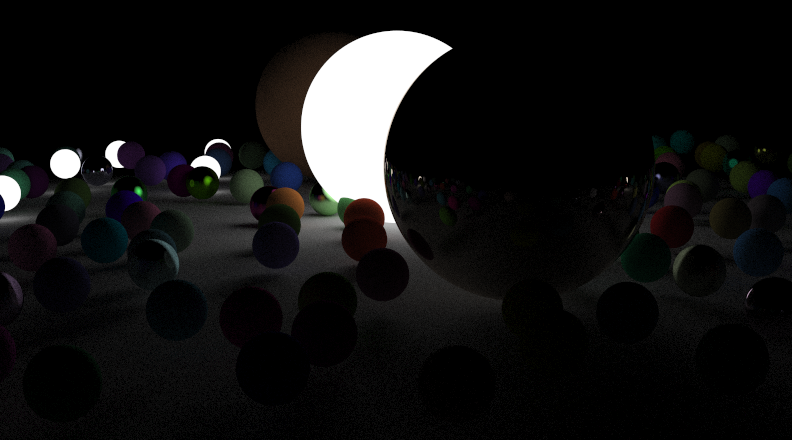

# PathTracer

This is my personally developed CPU-based path tracer. It simulates the boucing of light around a scene of objects to produce beautiful images.

* Written completly in **C**, no outside libraries used other than SDL for display of the final image
* Supports multiple models all loaded from **obj** files
* Uses a **bounding volume heiarchy** (BVH) to spatial partition the scene and speed up rendering
* Takes advantage of **SSE** on modern CPUs for ray-bounding box and soon ray-triangle intersections
* Uses all your CPU cores for close to linear performance scalling

# Examples:
## Standford Dragon - 8000 triangles

  

## Sphere Scene - 300 Spheres

  

# Performace:
All rendered with 500 samples at 1400x800

| Model  | Naive | BVH | SAH1 |
| ------------- | ------------- | ------------- | ------------- |
| Standford Dragon  | 10:27 | 92s | 75s |
| Sphere Scene  | 5:15 | 112s | 102s |

1 is a BVH constructed with a Surface Area Heuristic (SAH)
